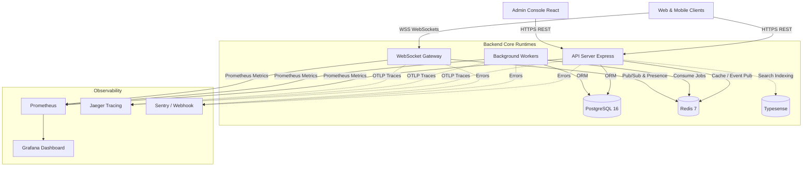

# Vocational Services Platform (VSP)

> A monorepo platform connecting vocational workers and clients, featuring a Node.js/Express backend API, asynchronous job workers, real-time WebSocket gateway, and a React-based administrative console.

[](https://github.com/edwardnyame/vsp/actions/workflows/backend-ci.yml)
[](LICENSE)

---

## Table of Contents

- [Overview](#overview)
- [Features](#features)
- [Tech Stack](#tech-stack)
- [Architecture](#architecture)
- [Prerequisites](#prerequisites)
- [Installation & Setup](#installation--setup)
- [Environment Variables](#environment-variables)
- [Usage & Commands](#usage--commands)
- [Project Structure](#project-structure)
- [API Reference](#api-reference)
- [Observability & Operations](#observability--operations)
- [Testing & Verification](#testing--verification)
- [Deployment & CI/CD](#deployment--cicd)
- [License](#license)


---

## Overview

The Vocational Services Platform (VSP) provides the backend core infrastructure and administrative frontend for a marketplace connecting clients with vocational service providers (e.g., technicians, tradespeople, service professionals).

The platform supports end-to-end service delivery: user and worker profiles, request management, booking workflows, real-time messaging, review systems, billing, moderation, support desk operations, and real-time observability. Architecturally, it follows a modular monolith approach in Express/TypeScript with decoupled background workers (BullMQ/Redis) and a dedicated WebSocket gateway runtime.

---

## Features

- **Authentication & Security**: JWT-based access/refresh token pair handling, RSA-256 signatures, key rotation support (`JWT_PUBLIC_KEY_BASE64_PREVIOUS`), TOTP and SMS multi-factor authentication (MFA) with AES-256 encrypted secrets, session revocation, and step-up auth for high-risk actions.
- **Role-Based Access Control (RBAC)**: Fine-grained admin roles (`SUPER_ADMIN`, `ADMIN`, `MODERATOR`, `SUPPORT`) and client/worker account separation.
- **Service Request & Booking Pipeline**: Lifecycle tracking from request submission through quotes, scheduling, job status updates, completion, and reviews.
- **Real-Time Gateway**: Dedicated WebSocket server for live presence, chat messaging, and event delivery backed by Redis Pub/Sub.
- **Background Processing & Queues**: Asynchronous execution of media processing, notification dispatch, search indexing, and scheduled cleanup using BullMQ.
- **Search & Discovery**: Fast worker and service search integration powered by optional Typesense engine.
- **Admin Desk Console**: React SPA featuring dashboard analytics, user session management, moderation queues, support ticket workflows, and CSV export utilities.
- **Observability Suite**: Prometheus metrics endpoint, Jaeger OpenTelemetry OTLP tracing, Sentry error-reporting integration, and pre-built Grafana dashboards with Alertmanager routing.
- **Operational Verifiers**: Automated scripts for zero-downtime database backup/restore verification, secret generation, MFA re-wrapping, and artifact drift checking.

---

## Tech Stack

### Backend
| Layer | Technology |
|---|---|
| Runtime | Node.js (>=20.0.0) |
| Language | TypeScript 5.7 |
| Web Framework | Express 4.21 |
| ORM & Database | Prisma 5.22, PostgreSQL 16 |
| Cache & Queue | Redis 7 (ioredis, BullMQ 5.16) |
| Real-time | WebSocket (`ws` 8.18) |
| Search | Typesense 27.1 |
| Auth & Crypto | JSON Web Tokens (`jsonwebtoken`), `bcrypt`, `otplib`, `twilio` |

### Frontend (Admin Console)
| Layer | Technology |
|---|---|
| Library & Build | React 18, Vite 5, TypeScript 5.6 |
| State & Query | TanStack React Query 5.91 |
| Routing & Forms | React Router 6, React Hook Form 7, Zod 4 |
| Styling & UI | Tailwind CSS 3, Lucide React, Sonner, Recharts |
| E2E Testing | Playwright 1.55, `@axe-core/playwright` |

### Observability & Infrastructure
| Service | Tooling |
|---|---|
| Containers | Docker, Docker Compose |
| Monitoring | Prometheus 2.54, Grafana 11.1, Alertmanager 0.27 |
| Distributed Tracing | OpenTelemetry Node SDK, Jaeger 1.61 |
| Error Reporting | Sentry (`@sentry/node` 10.45) |

---

## Architecture

VSP employs a modular monolithic backend codebase with distinct operational execution targets:

1. **HTTP API Server**: Handles client and admin REST endpoints, request validation, authentication, and synchronous business logic.
2. **Background Workers**: Dedicated process executing async jobs (BullMQ queues) for heavy computation, external webhooks, and push notifications.
3. **WebSocket Gateway**: Separate lightweight server handling persistent client connections, heartbeats, presence state, and live notifications via Redis Pub/Sub.
4. **Admin Web SPA**: Vite/React interface communicating with the backend API over HTTPS.



---

## Prerequisites

- **Node.js**: `^20.0.0` (LTS recommended)
- **npm**: `>=10.0.0`
- **PostgreSQL**: `>=16.0` (with `pg_dump`, `pg_restore`, `psql` CLI tools installed)
- **Redis**: `>=7.0`
- **Docker & Docker Compose**: (Optional, for containerized local runtime)

---

## Installation & Setup

### 1. Repository Setup

Clone the repository:
```bash
git clone https://github.com/edwardnyame/vsp.git
cd vsp
```

### 2. Environment Configuration

Copy environment template files:
```bash
cp backend/.env.example backend/.env
cp frontend-admin/.env.example frontend-admin/.env
```

Generate fresh development secrets for JWT, MFA, and storage signing:
```bash
cd backend
npm install
npm run ops:secrets:generate
cd ..
```

### 3. Database Migration & Seeding

Deploy Prisma migrations and seed initial test fixtures:
```bash
cd backend
npm run db:migrate:deploy
npm run db:seed
cd ..
```

---

## Environment Variables

### Backend Core Configuration (`backend/.env`)

| Variable | Description | Default / Required |
|---|---|---|
| `NODE_ENV` | Environment mode (`development`, `test`, `production`) | `development` |
| `PORT` | API HTTP port | `3000` |
| `APP_BASE_URL` | Base URL of the API server | **Required** (e.g. `http://localhost:3000`) |
| `DATABASE_URL` | PostgreSQL connection URL | **Required** |
| `REDIS_URL` | Redis connection URL | **Required** |
| `CORS_ALLOWED_ORIGINS` | Comma-separated list of allowed origins | **Required** |
| `CDN_BASE_URL` | Public CDN base URL for media files | **Required** |
| `STORAGE_SIGNING_SECRET` | Secret key for signed media URLs | **Required** |
| `JWT_PRIVATE_KEY_BASE64` | Base64-encoded RSA PEM private key | **Required** |
| `JWT_PUBLIC_KEY_BASE64` | Base64-encoded RSA PEM public key | **Required** |
| `JWT_PUBLIC_KEY_BASE64_PREVIOUS` | Base64-encoded key for zero-downtime rotation | Optional |
| `MFA_ENCRYPTION_KEY_BASE64` | Base64 32-byte key for MFA secret encryption | **Required** |
| `INTERNAL_API_KEY` | Key for internal metrics/monitoring endpoints | Required in `production` |
| `EVENT_BUS_MODE` | Event dispatch mechanism (`inline` or `queue`) | `inline` |
| `BACKGROUND_WORKERS_ENABLED` | Run workers in API process if set `true` | `false` |
| `WS_GATEWAY_PORT` | WebSocket gateway server port | `3002` |
| `TWILIO_VERIFY_MOCK_MODE` | Enable mock mode for Twilio SMS MFA | `true` |
| `TWILIO_ACCOUNT_SID` | Twilio Account SID | Required if mock mode `false` |
| `TWILIO_AUTH_TOKEN` | Twilio Auth Token | Required if mock mode `false` |
| `TWILIO_VERIFY_SERVICE_SID` | Twilio Service SID | Required if mock mode `false` |
| `TYPESENSE_HOST` | Hostname for Typesense engine | Optional |
| `TYPESENSE_API_KEY` | API Key for Typesense search engine | Required if `TYPESENSE_HOST` set |
| `TRACING_ENABLED` | Enable OpenTelemetry tracing | `false` |
| `OTEL_EXPORTER_OTLP_TRACES_ENDPOINT` | OTLP collector endpoint URL | Optional |
| `SENTRY_ENABLED` | Enable Sentry error reporting | `false` |
| `SENTRY_DSN` | Sentry project DSN | Required if `SENTRY_ENABLED=true` |

### Frontend Admin Configuration (`frontend-admin/.env`)

| Variable | Description | Default / Required |
|---|---|---|
| `VITE_API_BASE_URL` | Target API base URL | **Required** (e.g. `http://localhost:3000/api/v1`) |
| `VITE_APP_NAME` | Display application title | `VSP Admin` |
| `VITE_APP_RELEASE` | Build/Release identifier | `local` |
| `VITE_ERROR_REPORTING_ENABLED` | Enable error reporting | `false` |
| `VITE_ERROR_REPORTING_ENDPOINT` | Error intake webhook URL | Optional |

---

## Usage & Commands

### Monorepo Makefile Targets

| Command | Purpose |
|---|---|
| `make backend-dev` | Start API server in watch mode |
| `make backend-workers` | Start background worker process |
| `make backend-gateway` | Start WebSocket gateway server |
| `make backend-test` | Run backend unit & integration tests |
| `make backend-ci` | Run full backend CI verification pipeline locally |
| `make compose-up` | Boot Docker Compose API service |
| `make staging-up` | Boot full staging-like stack (API, Admin, Workers, Gateway) |
| `make staging-gate` | Run E2E release gate against staging stack |
| `make staging-down` | Stop staging Docker stack |
| `make final-hard-gate` | Execute complete repository hard release gate |

### Backend Development

```bash
cd backend
npm run dev        # API in watch mode (http://localhost:3000)
npm run workers    # Background worker runtime
npm run gateway    # WebSocket gateway runtime (ws://localhost:3002/ws)
```

### Admin Console Development

```bash
cd frontend-admin
npm run dev        # Vite dev server (http://localhost:5173)
npm run build      # Production build
npm run preview    # Preview built admin bundle (http://localhost:4173)
```

### Docker Compose Local Stack

Boot full containerized stack:
```bash
docker compose up --build api admin-web
```

Include monitoring (Prometheus + Grafana + Alertmanager):
```bash
docker compose --profile monitoring up --build
```

---

## Project Structure

```text
.
├── backend/                       # Node.js + Express + Prisma Monolith Core
│   ├── contracts/                 # Generated OpenAPI 3.1 & route artifacts
│   ├── observability/             # Prometheus, Grafana & Alertmanager configs
│   ├── prisma/                    # Database schema and seed scripts
│   │   ├── schema.prisma
│   │   └── seed.ts
│   ├── reports/                   # Route inventory and HTTP test coverage
│   ├── scripts/                   # CI, backup, restore & ops scripts
│   └── src/
│       ├── bootstrap/             # Runtimes: api.ts, workers.ts, gateway.ts
│       ├── config/                # Environment schema and loaded configs
│       ├── gateway/               # WebSocket connection manager & Redis pub/sub
│       ├── middleware/            # Auth, RBAC, error handling, tracing
│       ├── modules/               # Domain feature modules (auth, admin, requests, etc.)
│       ├── queues/                # BullMQ queue definitions and job dispatches
│       └── workers/               # Worker job processors
├── frontend-admin/                # React 18 Admin Web Application
│   ├── e2e/                       # Playwright browser automation test scripts
│   ├── public/                    # Static assets
│   ├── scripts/                   # Verification utilities
│   └── src/
│       ├── components/            # Reusable UI components
│       ├── features/              # Modular admin domain screens & hooks
│       ├── lib/                   # API client, auth context & helpers
│       └── pages/                 # Top-level route pages
├── doc/                           # Architecture specifications & system design packs
├── scripts/                       # Repository-wide release gates
├── compose.yml                    # Main Docker Compose orchestration spec
├── Makefile                       # Top-level command runner shortcuts
├── .env.staging.example           # Staging environment template
└── LICENSE                        # Repository license file
```

---

## API Reference

The backend API is served under `/api/v1`. OpenAPI 3.1 contracts are automatically generated in `backend/contracts/openapi.json`.

### Core Health & Operations

- `GET /api/v1/health` — API liveness check.
- `GET /api/v1/health/ready` — API readiness check (verifies database & Redis connectivity).
- `GET /api/v1/internal/metrics` — Prometheus metrics endpoint (requires `INTERNAL_API_KEY`).

### Primary Feature Modules

- **Auth (`/api/v1/auth`)**: Register, login, token refresh, logout, session revocation, MFA TOTP setup/verify, SMS request/challenge.
- **Admin (`/api/v1/admin`)**: User management, account session revocation, role assignments, audit logs.
- **Worker Profiles (`/api/v1/worker-profiles`)**: Skills, service areas, availability, verification status.
- **Requests & Bookings (`/api/v1/requests`, `/api/v1/bookings`)**: Service request creation, quoting, acceptance, scheduling, and job state transitions.
- **Chat (`/api/v1/chat`)**: Conversation threads and direct message history.
- **Moderation & Support (`/api/v1/moderation`, `/api/v1/support`)**: Flagged content review, reports, dispute handling, support ticketing.

---

## Observability & Operations

### Database Backup & Restore Verification

The backend includes automated operational verification scripts to ensure disaster recovery procedures remain functional:

```bash
cd backend
npm run ops:backup          # Takes PostgreSQL dump in custom format
npm run ops:restore:verify  # Restores into scratch DB and verifies schema integrity
```

### Key Rotation Utilities

- **MFA Secrets**: Re-encrypt stored secrets under a new key:
  ```bash
  npm run ops:mfa:rewrap -- --dry-run
  ```
- **JWT Key Rotation**: Support zero-downtime key rotation by setting `JWT_PUBLIC_KEY_BASE64_PREVIOUS`.

---

## Testing & Verification

### Backend Suite

Run native integration tests:
```bash
cd backend
npm test
```

Run specialized test sub-suites:
```bash
npm run test:auth    # Auth module unit/integration tests
npm run test:admin   # Admin RBAC and session tests
```

### Admin Console E2E Tests

Run Playwright browser suite (covers MFA setup, moderation desks, bulk actions, and accessibility):
```bash
cd frontend-admin
npm run e2e:install   # One-time browser binary download
npm run e2e           # Run E2E tests headless
```

---

## Deployment & CI/CD

Continuous Integration is powered by GitHub Actions (`.github/workflows/backend-ci.yml`). On every push to `backend/**`, CI provisions ephemeral PostgreSQL and Redis service containers, runs database migrations, executes artifact drift checks, runs the test suite, verifies tracing OTLP export, and tests backup/restore flows.

---

## License

This project is licensed under the [MIT License](LICENSE).

